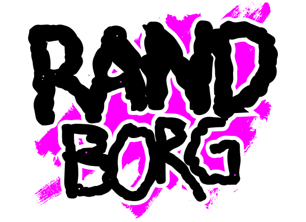
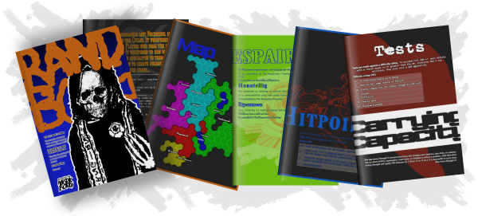
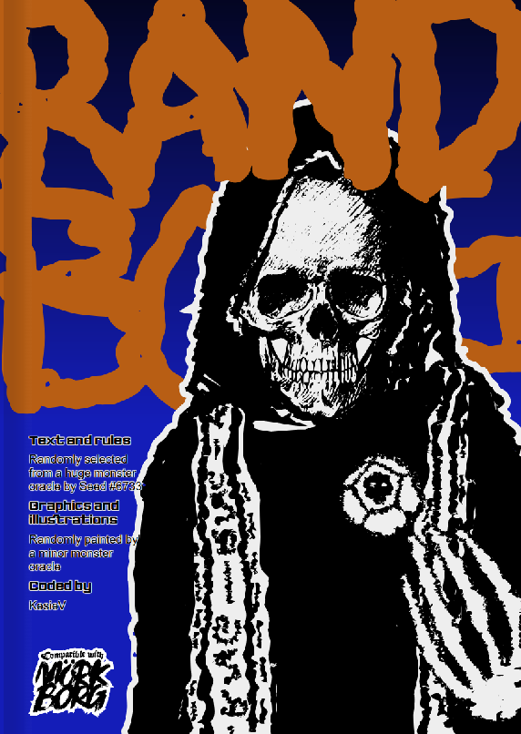
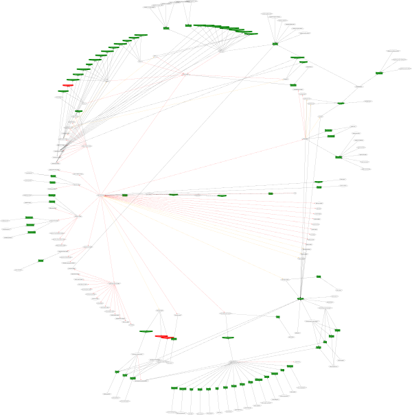
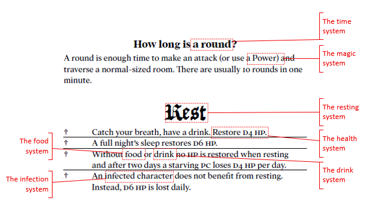
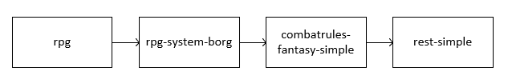
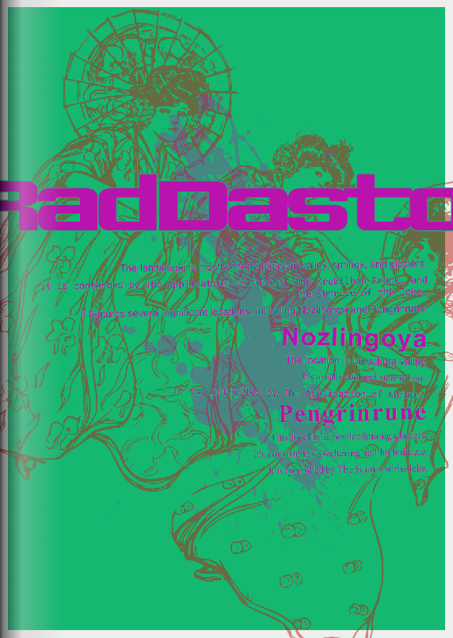
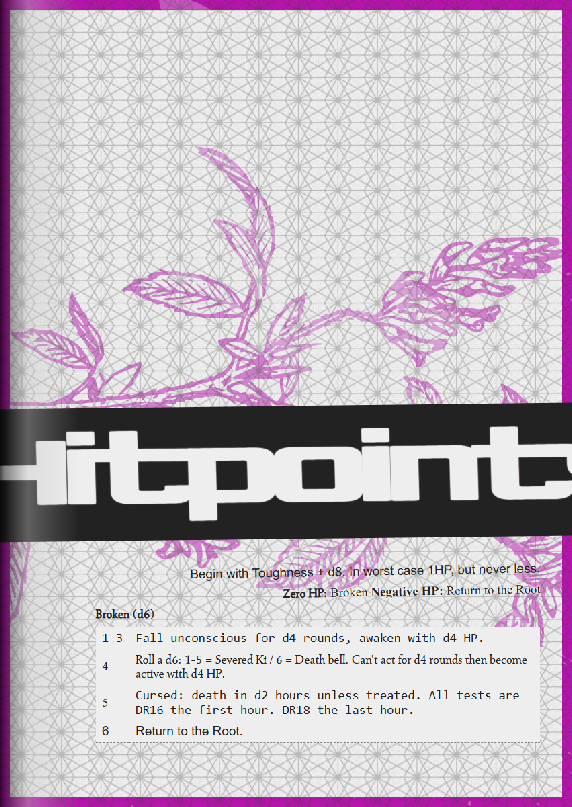

# RAND BORG

<div align="center"><p></p></div><div align="center" style="font-weight:bold">An open-source kaleidoscope of madness.</div>

---

<div align="center"><a href="https://www.kesiev.com/randborg/">Spawn a New Seed</a> | <a href="https://discord.gg/TeAWvnuGku">Discord</a> | <a href="#full-credits">Full credits</a></div>

---

## The project

**RAND BORG** is an open-source _kaleidoscope of madness_: it randomly generates mini-RPG manuals in the style of [M&ouml;rk Borg](https://en.wikipedia.org/wiki/M%C3%B6rk_Borg) using giant oracle systems. But why does this monstrosity exist?

**For the community**, it's an act of love for this game, a small contribution, and a sign of respect for their brilliant designers.

**For you**, it's a kaleidoscope of horrors and nonsense. Flip through its unreadable, incomplete, crazy pages, get sucked into the wildest chaos, and seek inspiration for your next worlds. If you want to experience _true_ pain, well, then try organizing a one-shot with some scvms.

<div align="center" style="margin:60px 0">
    <p></p>
</div>

**For me**, it's the embodiment of my studies on the design of this game and the artistic phenomenon surrounding it. They're living notes, steeped in my time. I'll talk about them a bit in this README. I hope you'll follow along.

### The Violated Temple

[M&ouml;rk Borg](https://morkborg.com/) is a fantasy role-playing game published in 2020 and designed by Pelle Nilsson and Johan Nohr. Its entire manual is a 100-ish page book, which describes the rules engine, the setting, the narrative, a few player classes, a set of weapons and items, a slim beastiary, some oracle-based generators, and an introductory adventure.

Fun fact: Much of the book is taken up by splendid gothic illustrations in bold color palettes, among which the game's few rules pop up now and then. It certainly takes a clear distance from the ergonomics of classic role-playing game manuals.

Despite that, quoting [Wikipedia](https://en.wikipedia.org/wiki/M%C3%B6rk_Borg), _"Its popularity resulted in a large number of expansions, supplements, and adventures created by the fan community"_, and, in my humble opinion, it's a very reductive way of describing the phenomenon.

Have a look at [Ex Libris](https://morkborg.exlibrisrpg.com/), an annotated directory of content, tools, and resources for the M&ouml;rk Borg. There are +700 modules made by _fans_. What do these modules do?

They mostly are _tiny modules_ that expand the game in any direction: tiny expansions for more items, tiny expansions for more adventures, tiny expansions for more classes, tiny expansions for more enemies, tiny expansions for more rules, and then [rules for playing the game alone](https://1d105.itch.io/solitary-defilement), [rules for playing the game as a cat](https://antigravitypajamas.itch.io/cat-who-used-to-be-royalty), [rules printed in the inlay of a LP vinyl](https://jnohr.itch.io/putrescence-regnant), [rules for playing the game as a fort](https://gvix.itch.io/borg)... Have a look at [this](https://www.youtube.com/watch?v=U62H6DFgg7o) to have some good fun!

RPG rules usually describe delicate ecosystems, sacred temples that can be expanded with precise shots.

This game, instead, dragged a lot of people into designing and illustrating hundreds of tiny modules. It made them feel capable of doing it, of being able to create something beautiful and useful for others without making them feel too burdened by the responsibility and experience.

_Why?_

### Dissecting the Flagellated Corpse

I slammed the M&ouml;rk Borg Italian manual in the cart as a Christmas gift, together with its official cyberpunk spiritual successor [Cy_Borg](https://freeleaguepublishing.com/games/cy_borg/). I've played a campaign for each with my wife, using the [Mythic 2e](https://www.wordmillgames.com/page/mythic-gme.html) system as Game Master. We played _almost every day_. We had a blast.

Then, we started discussing it. We started _dissecting it_ as we usually do with the stuff we find interesting.

<div align="center" style="margin:60px 0">
    <p></p>
    <p>The RAND BORG virtual cover follows the style of M&ouml;rk Borg's manual.</p>
</div>

In general, during a roleplaying session and from time to time, the GM may need to open the manual to check specific rules or consult lists and oracles. To keep the pace of the game going, these consultations must be as quick as possible, so the manual's precise organization and its clarity and readability are essential.

In this manual, neither the font nor the text alignments are predictable or uniform, and the illustrations, with their uneven style and bright colors, push it in every direction.

Some might say that _style has killed usability. But, in my opinion, that murder conceals a secret, an almost whispered pact between them. It conceals _that why_ from the chapter before.

Everything in M&ouml;rk Borg, from the graphics to the rules, is **modular** and **interpretable**. It's a sacred text to be interpreted. It's a tattered artifact. It's a Lego with a thousand shapes.

### The Broken Oracle

What _the heck_ is the creature on the cover of the M&ouml;rk Borg manual? Who _the heck_ is the cloaked goat on the _back_ of the M&ouml;rk Borg manual? What do the symbols on the Omens explanation page mean? Who is the 4-eyed monk on page 32?

Wait, there is more.

Yeah, M&ouml;rk Borg is a _game_. But where in the frigging manual is it written that M&ouml;rk Borg _is an RPG_? How is it played? Where are the usual GM suggestions? _Where is the character sheet?_ How should the oracles scattered around the pages be used?

Images and rules are scattered around in chaos. They are pieces that perhaps, once, were part of something. Images of a forgotten place. Rules of a world that no longer exists.

_Written by hundreds of now nameless hands._

Voil&agrave;. There it is, the secret, in plain sight.

Whether you're a master artist or can make a few stylized drawings, whether you know how to formulate a game with complex rules or are barely able to understand the odds of a number rolling on a die, there's only a fragment of you left in this world. You just have to describe _that fragment_.

Anyone can add rubble to the Dark Castle. Those who visit will find a place for them.

And, for me, all of this is wonderful. It's a simulation of the crucible of chaos, from which everyone drinks to find their own way to call it life. It's art in its purest form. It's the secret of life.

_But is it true?_

### The Monster Oracle

Time for me to introduce _the Monster Oracle_ that moves RAND BORG.

<div align="center" style="margin:60px 0">
    <p></p>
    <p>The oracle network behind RAND BORG.</p>
</div>

You can see _a slightly more readable version_ [here](markdown/oracle.svg).

To prove my theory, first I've _dissected_ some M&ouml;rk Borg manual parts to separate all the systems and relations between them...

<div align="center" style="margin:60px 0">
    <p></p>
    <p>How I've split the systems from the manual. (from the free <a target=_blank href='https://morkborg.com/content/'>Bare Bones</a> version)</p>
</div>

...then I've joined them back together...

<div align="center" style="margin:60px 0">
    <p></p>
    <p>A slice of the Monster Oracle</p>
</div>

...then, I've coded a program that put all the parts in their original places...

```
 - {$.capital($.makeCallListOf(0,"shortrestaction","shortRestAction",1))}. Restore {$.playerHitpoints.getSmallCure()}.
```

_From `rest.js`: this gathers anything in the network that describes a short rest (For example, "have a drink" will come from the drinking system) and asks what a small cure is to the health system to stitch them in a sentence._

...and finally, I've turned most of these systems into _oracles_ - lists in which you usually roll a die to decide something. Some of these systems even become _optional_ (i.e., some manuals may have some of them missing) or _replaced by something else_ (i.e., some systems may work differently).

```
{
    id:"statset-sociality-1",
    tags:[ "trait", "sociality" ],
    requires:[
        { id:"presence", reuse:true, ofTags:[ [ "stat-presence" ] ] }
    ]
},{
    id:"statset-sociality-2",
    tags:[ "trait", "sociality" ],
    requires:[
        { id:"presence", reuse:true, ofTags:[ [ "stat-presence" ] ] },
        { id:"charisma", reuse:true, ofTags:[ [ "stat-charisma" ] ] },
    ]
},{
    id:"statset-sociality-3",
    tags:[ "trait", "sociality" ],
    requires:[
        { id:"presence", reuse:true, ofTags:[ [ "stat-presence" ] ] },
        { id:"intelligence", reuse:true, ofTags:[ [ "stat-intelligence" ] ] },
    ]
},{
    id:"statset-sociality-4",
    tags:[ "trait", "sociality" ],
    requires:[
        { id:"presence", reuse:true, ofTags:[ [ "stat-presence" ] ] },
        { id:"charisma", reuse:true, ofTags:[ [ "stat-charisma" ] ] },
        { id:"intelligence", reuse:true, ofTags:[ [ "stat-intelligence" ] ] },
    ]
},
```
_From `sociality.js`: yeah, the original presence system coded by `statset-sociality-1` is cool. But why not add the charisma stat back with `statset-sociality-2`? Or the intelligence stat for casting spells with `statset-sociality-3`? RAND BORG will randomly select a system and formulate the magic/sociality system accordingly._

Rinse and repeat for most of the M&ouml;rk Borg systems.

Now you can master a session played by _charismatic cowboys with a laser gun_. Or a bunch of _samurai scvms looking for a 3-headed goblin_.

Is this _chaotic_? For sure. Is this _useless_? Maybe. Is this _a beautiful mess_? _Oh, yeah_.

But I'm not finished yet.

### The Minor Monster Oracle

As I was separating the system, I set 3 of them to work together to build the game world _setting_. The `setting-fantasy` system, which adds goblins and dragons, the `setting-grim` system that adds undead and monsters, and the `setting-investigative` system that gives mysteries and the tools to solve them.

To these 3, I've added 3 new systems that add a cyberpunk (`setting-cyberpunk`), fantasy medieval japan (`setting-japan`), and wild west setting (`setting-wildwest`). As for the previous chapters, a subset of these 6 systems is selected to fill up oracles, world regions, names, etc. That's why RAND BORG may instruct you to play as _a cowboy with a laser gun_.

But _words_ are just one half of the puzzle. In the M&ouml;rk Borg manual, they have a dialogue with the images, the colors, and the symbols around them. Images and words must be decoded to create a glimpse of the game world.

But their meaning _is incomplete_ as many of their parts _are missing_. These missing parts are _inside the reader_, which will pull them from his mind to create an image that speaks as much about the game as it does about himself.

So, I've built _an oracle for the page layout_. Images, fonts, color palettes, text arrangements, paper effects, rotations, and anything else are decided by the roll of a dice. My _beautiful mess_ mutated into a _kaleidoscope of madness_.

<div align="center" style="margin:60px 0">
    <p></p>
    <p>Who are these girls? People from Nozlingoya?</p>
</div>

<div align="center" style="margin:60px 0">
    <p></p>
    <p>Is that a healing herb?</p>
</div>

We're _kilometers_ away from handmade works. _Heck_, it's a page entirely made by dice rolls. But still, it works. The art and the words are working together despite the style, and _even if it is not intended_.

_(Hey, quick note. I make this kind of stuff just for studying and for fun and I usually try to avoid third party stuff as much as I can. This time it was impossible - and I was more than happy to build something with blocks someone else made with love! I attempted to use free or license-compatible stuff and to credit the authors as much as I could but, PLEASE. Have a look at the [Full Credits](#full-credits) section of this page! If you want your name or your stuff added or removed from the project, or if you have any kind of suggestion about the licensing, contact me. Thanks!)_

### Head on the block

There's much more to tell:

 - How does the random name generator work, and how is it influenced by the settings?
 - How is the world map generated, and how are its topography and weather determined?
 - How did I formulate the rules for actions and spells without knowing which statistics would be used?
 - Why did I decide to add a glossy effect to the pages and cover?
 - Why can't I print the manual?
 - Who is the Massive Randomness?

I don't want to bore you, my friend. In fact, I thank you infinitely if you've managed to read this far.

The time has come for conclusions. Have I achieved my goal? Have I proven my hypothesis?

I've been reading many of the manuals created by RAND BORG. They speak of meaningless worlds, with absurd places and monstrous creatures. The images come from an alien, nonexistent, and impossible world.

It's a sweet torture for the mind and the eyes, where hundreds of pieces and pixels crash into each other, searching for their place. And from this discovery, the lore of this project is born:

_The Massive Randomness met Nechrubel in the interstice between the Cycles. It whispered to him of the GM and the Players who drag the suffering souls of his world. It whispered to him of a way to bring torment and apocalypse to them, too. It whispered to him how to create unlimited worlds of pure chaos..._

Art is always filtered by those who experience it, and it's difficult to explain objectively. However, RAND Borg managed to convince me of my theories. Furthermore, it gave me a place to go from time to time when I'm in search of inspiration.

As usual, I'm leaving this project in the hands of the internet. I hope someone else finds it useful and interesting.

Oh, and feel free to share your impressions! See ya!

## Full credits

### Code

 - **RAND BORG code** by KesieV ([GPL3](LICENSE))
 - [Drawdown](https://github.com/adamvleggett/drawdown) library by Adam Leggett ([MIT](https://github.com/adamvleggett/drawdown/blob/master/LICENSE)) - modified by KesieV for the project

### Images

 - **Map hexagon** by KesieV ([GPL3](LICENSE))
 - **Cover art** by KesieV ([GPL3](LICENSE))
 - **SVG clipart** from [SVG Silh](https://svgsilh.com/) ([CC0](https://creativecommons.org/publicdomain/zero/1.0/legalcode.en))

#### Cyberpunk setting textures (www.transparenttextures.com - [CC-BY-3.0](https://creativecommons.org/licenses/by/3.0/it/deed.it))

 - `textures-1.png`: 3Px by Gre3g
 - `textures-2.png`: Black Thread by Listvetra
 - `textures-3.png`: Dark Mosaic by John Burks
 - `textures-4.png`: Diagmonds by INS
 - `textures-5.png`: Escheresque by Jan Meeus
 - `textures-6.png`: White Diamond by Atle Mo

#### Fantasy setting textures (www.transparenttextures.com - [CC-BY-3.0](https://creativecommons.org/licenses/by/3.0/it/deed.it))

 - `textures-1.png`: Dark Wood by Omar Alvarado

#### Grim setting textures (www.transparenttextures.com - [CC-BY-3.0](https://creativecommons.org/licenses/by/3.0/it/deed.it))

 - `textures-1.png`: Brick Wall by Benjamin Ward
 - `textures-2.png`: Shley Tree 1 by Derek Ramsey
 - `textures-3.png`: Shley Tree 2 by Mike Hearn
 - `textures-4.png`: Mocha Grunge by Joel Klein

#### Investigation setting textures (www.transparenttextures.com - [CC-BY-3.0](https://creativecommons.org/licenses/by/3.0/it/deed.it))

 - `textures-1.png`: Black Orchid by Hybridixstudio
 - `textures-2.png`: 45 Degree Fabric by Atle Mo

#### Japan setting textures (www.transparenttextures.com - [CC-BY-3.0](https://creativecommons.org/licenses/by/3.0/it/deed.it))

 - `textures-1.png`: Grunge Wall by Adam Anlauf
 - `textures-2.png`: Light Sketch by Dan Kruse
 - `textures-3.png`: Nami by Dertig Media
 - `textures-4.png`: Skulls by Adam
 - `textures-5.png`: Purty Wood by Richard Tabor
 - `textures-6.png`: Washi by Carolynne

#### Wild west setting textures (www.transparenttextures.com - [CC-BY-3.0](https://creativecommons.org/licenses/by/3.0/it/deed.it))

 - `textures-1.png`: White Leather by Atle Mo
 - `textures-2.png`: Old Map by Andreas Föhl
 - `textures-3.png`: Asfalt by Atle Mo

### Fonts

 - **1942 Report** by Johan Holmdahl (Freeware)
 - **Ferrum** by Sora Sagano ([CC0](https://creativecommons.org/publicdomain/zero/1.0/legalcode.en))
 - **Florante at Laura** by Nyek! Pinoy Komik Fonts ([Nyek! License](https://www.fontsquirrel.com/license/gong))
 - **League Gothic** by The League of Moveable Type ([SIL v1.10](https://www.fontsquirrel.com/license/league-gothic))
 - _(My beloved)_ **Seshat** by Sora Sagano ([CC0](https://creativecommons.org/publicdomain/zero/1.0/legalcode.en))
 - **Smokum** by Astigmatic ([Apache license](https://www.fontsquirrel.com/license/smokum))
 - **The Neue Black** by The League of Moveable Type ([SIL v1.10](https://www.fontsquirrel.com/license/league-gothic))
